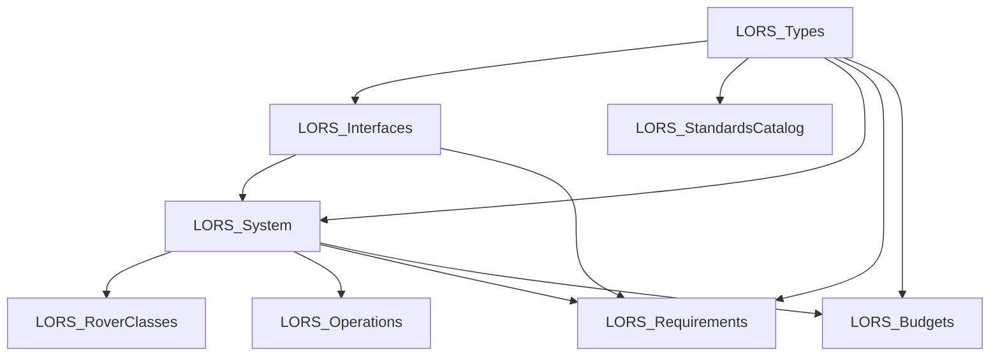

# LORS SysML v2 Model

> **Status**: v0.1.0-draft — Baseline for automated standards definition  
> **Date**: 2026-03-26  
> **Standard**: [OMG SysML v2 Textual Notation](https://www.omgsysml.org/SysML-v2.htm)

## Purpose

This directory contains the **machine-readable, version-controlled** SysML v2 model of the Lunar Open-source Rover Standard (LORS). It serves as:

1. **Single Source of Truth** — Every interface, requirement, and constraint lives in one model
2. **Automated Verification** — Constraint definitions can be evaluated against design instances
3. **Standards-as-Code** — The standard itself is diffable, reviewable, and CI/CD-compatible
4. **Tool Interoperability** — SysML v2 textual notation is supported by Eclipse SysON, Cameo, Syndeia, and other MBSE tools

## Model Structure

```
model/
├── library/                         # Reusable type definitions
│   ├── units_and_types.sysml        # SI units, enums, value types
│   ├── interfaces.sysml             # Port & interface definitions
│   └── standards_catalog.sysml      # Applicable standards references
│
├── system/                          # System decomposition
│   ├── lors_system.sysml            # Top-level ecosystem & subsystems
│   ├── rover_classes.sysml          # Class A/B/C specializations + landers
│   └── operations.sysml             # State machines, commands, lifecycle
│
├── requirements/                    # Formal requirements (normative)
│   ├── system_requirements.sysml    # 25+ qualitative requirements
│   └── budget_requirements.sysml    # Quantitative budget requirements
│
├── analysis/                        # Instance-level analysis (informative)
│   └── budgets.sysml                # Template for mission-specific budgets
│
└── README.md                        # This file
```

## Package Dependency Graph



## Key Design Decisions

### Why SysML v2 (not v1)?

| Feature | SysML v1 (XMI/UML) | SysML v2 (Textual) |
|---------|--------------------|--------------------|
| Version control | ❌ Binary XMI, unusable diffs | ✅ Plain text, git-native |
| Review process | ❌ Requires modeling tool | ✅ Readable in any editor |
| CI/CD automation | ❌ Tool-specific APIs | ✅ Parseable by standard tooling |
| Constraint checking | ❌ OCL (complex) | ✅ Native constraint expressions |
| Open standard | 🟡 Vendor-locked tooling | ✅ OMG open specification |

### Model Coverage

The model captures **8 domains** from the LORS documentation:

| Domain | Source Document | Model File |
|--------|----------------|------------|
| Type System | All docs | `library/units_and_types.sysml` |
| Interfaces | Architecture Analysis §4–5 | `library/interfaces.sysml` |
| Applicable Standards | STANDARDS_AND_DOCS.MD | `library/standards_catalog.sysml` |
| System Architecture | Architecture Analysis §3 | `system/lors_system.sysml` |
| Rover Classes | Architecture Analysis §3.1–3.3 | `system/rover_classes.sysml` |
| Operations | ROVER_COMMANDS.MD | `system/operations.sysml` |
| Requirements (Qualitative) | DESIGN_GUIDE.MD + all reports | `requirements/system_requirements.sysml` |
| Requirements (Quantitative) | Systems Engineering Skill | `requirements/budget_requirements.sysml` |
| Analysis Templates | Instance data | `analysis/budgets.sysml` |

## How to Use

### 1. Read & Review

All `.sysml` files are plain text — open in any editor. Key patterns:
- `part def` = Structural blueprint (e.g., rover, subsystem)
- `port def` = Interface point (electrical, data, mechanical)
- `requirement def` = Formal "shall" statement with constraints
- `constraint def` = Mathematical/logical rule for budget verification
- `action def` = Behavioral operation (command, lifecycle step)
- `state def` = State machine (operational modes)

### 2. Tool Integration

| Tool | Import Method |
|------|--------------|
| [Eclipse SysON](https://eclipse.dev/syson/) | Open `.sysml` files directly (free, open-source) |
| [Cameo Systems Modeler](https://www.3ds.com/products/catia/no-magic/cameo-systems-modeler) | Import SysML v2 textual |
| [Syndeia](https://intercax.com/products/syndeia/) | Federation with PLM/ALM tools |
| Custom scripts | Parse with [SysML v2 API/Services](https://github.com/Systems-Modeling) |

### 3. Extend the Model

To add a new subsystem or requirement:
1. Define types in `library/units_and_types.sysml`
2. Define ports in `library/interfaces.sysml`
3. Add the `part def` in `system/lors_system.sysml`
4. Write requirements in `requirements/`
5. Add budget constraints in `analysis/budgets.sysml`
6. Link requirements to model elements via `satisfy` relationships

## Roadmap

- [ ] **v0.2**: Add verification definitions (`verify` links to test procedures)
- [ ] **v0.3**: Add allocation views (requirements → components → tests)
- [ ] **v0.4**: Add parametric analysis models (trade studies)
- [ ] **v0.5**: Add interface control document (ICD) generation templates
- [ ] **v1.0**: Baseline for LORS v1.0 standard release

## Contributing

Follow the same process as the rest of LORS (see [CONTRIBUTING.MD](../CONTRIBUTING.MD)):
- Requirements use `REQ-[SUBSYSTEM]-[NUMBER]` IDs
- All changes to `.sysml` files should be reviewed for model consistency
- Use `constraint` blocks for any quantitative threshold
